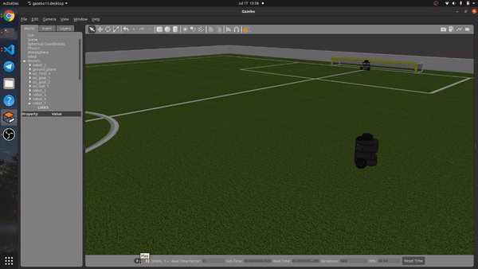
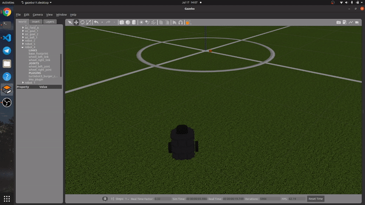
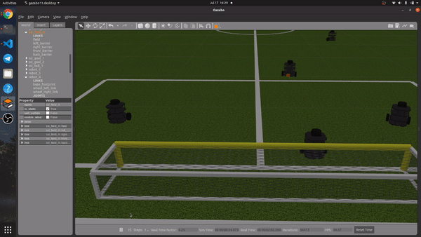
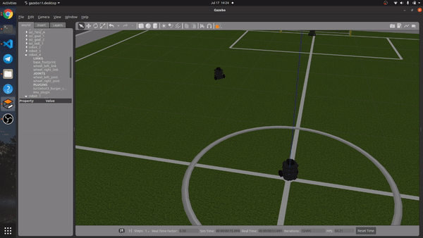

# SSL Simulator Using Gazebo-ROS

&nbsp;

## Developer:
### 10120004 - Nanda Pramudia Santosa
### 13520078 - Grace Claudia
### 13520109 - Patrick Amadeus Irawan
### 13520110 - Farrel Ahmad

&nbsp;

## Playing Environment
We create the model for our SSL Robocup playing environment using the already existed model file in Gazebo. The base model that we used are `Robocup 2014 SPL Field` , `Robocup 3D Simulator Goal` , and `RoboCup SPL Ball`. Using those base model we modified its size and looks to suit the [Rules of the RoboCup SSL](https://robocup-ssl.github.io/ssl-rules/sslrules.html) for division A. The model for our playing environment can be found within `ssl_ws/src/sslbot_gazebo/models/` . To spawn our playing environment model, we spawn it using the world files since it doesn't need much handling like the robot. Here are the final looks of our playing environment model,  

  

&nbsp;

## Robot Model and Model Plugin
For our robot model we use the .urdf format to make it easy when we want to use plugin within it. Our robot .urdf file can be found within `ssl_ws/src/sslbot_gazebo/urdf/` . We separate our model into two categories, one for the keeper and another for the rest of the robot. The plugin we used for our model are `planar move` for the keeper and `differential drive controller` for the rest of the field. The keeper used planar move for its movement because the keeper needs to go sideways and on a fixed track. Our robot publish its odometry to `/odom` topic and subscribe to `/cmd_vel` for its velocity. While the keeper publish its odometry to `/planar_odom` and subscribe to the topic `/planar_vel`. To spawn the robot we used the .launch file and give each robot we spawn its own namespace so we have no need to create separate .urdf file for each robot. Here are the robot model we used for testing of this package,  

&nbsp;

## Movement
Our robot movement is handled by publishing `twist` message to the `/cmd_vel` or `/planar_vel` topics. We used two input which is destination pose/coordinate and the odometry of the robot for the movement algorithm. At first, the robot will correct its orientation to face the destination. Then the robot will go to its destination in a straight line. Here are the demonstration,

&nbsp;

## Ball Chaser
For our robot ball chaser algorithm, we modified the movement algorithm to make its destination argument set to the ball pose message that we received from the /ball_state topic (message on this topic published from ball_state_pub node). The result is the robot will go to the ball's pose/coordinate. Here are the demonstration,

&nbsp;

## Dribble
The dribble algorithm for our robot use `/gazebo/set_model_state` service. At first, the robot will follow the ball. Then, once the distance between the ball and the robot is < 0.15m, the ball will stay in front of the robot and will continue dribble. The ball stays in front of the robot (0.09 m apart) using `/gazebo/set_model_state` service by calling it a lot of times until certain circumstances. To calculate the pose the ball is needed to be we used simple trigonometry with robot odometry as its variable. We also used our robot odometry information to make the ball also head to the direction where the robot is heading. Here are the demonstration,

&nbsp;

## Shooting
Our robot shooting mechanism utilize the `/gazebo/set_model_state` service. After the robot reach the designated position for its shooting, it will correct its orientation to head for the goal. After that, we send twist message to the ball with the ball itself for its _reference_frame_ so it will look like the robot just apply a force to make the ball shoot itself with a certain orientation (the robot orientation). However the service is only called once for the shot. Here are the demonstration,

&nbsp;

## Passing and Receiving Pass
Similar to how we handle shooting, we also use the `/gazebo/set_model_state` service for our passing algorithm. Instead of heading to the goal, the robot will head to the other robot direction. After that, we apply linear velocity to the ball and send it to head to the other robot. Once the ball has reached the other robot, that robot will catch/receive the ball. When the ball released from the first robot, its reference frame is the ball itself, but when the other robot receive the pass, the reference frame for the ball returned to the world. We also make sure so the `/gazebo/set_model_state` service only called once after the robot do the pass, so the ball doesn't try to be in both first and the other robot at the same time (blinking). Here are the demonstration,  

&nbsp;

## GoalKeeping
The keeper can do some goalkeeping action. When the ball is on the left side of the robot, it will strafe to the left, and whent the ball is on the right side of the robot, it will strafe to the right. This is possible because we write a different plugin for our keeper model, not like the rest of the robot which utilize the `differential drive controller` plugin, the keeper use the `planar move` plugin. After the ball is close enough to the robot (0.15 m), it will catch the ball and then correct its orientation to one of its teammates and pass the ball to them. When the passing is done, the keeper will correct its orientation to the original state and repeat the strafing and catching action. Here are the demonstration,

&nbsp;

## Goal/Out Detector
