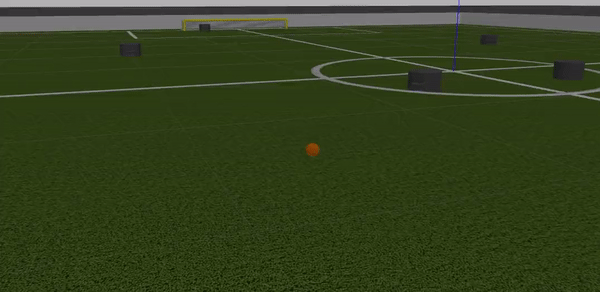

# SSL Simulator Using Gazebo-ROS

<p>&nbsp;</p>

## Developer:
### 10120004 - Nanda Pramudia Santosa
### 13520078 - Grace Claudia
### 13520109 - Patrick Amadeus Irawan
### 13520110 - Farrel Ahmad

<p>&nbsp;</p>

## Table of Contents
1. [Overview](https://gitlab.com/dagozilla/academy/2021-internship2/group-1/ssl-simulator#overview)
2. [How to Run the Simulation](https://gitlab.com/dagozilla/academy/2021-internship2/group-1/ssl-simulator#how-to-run-the-simulation)
3. [Playing Environment](https://gitlab.com/dagozilla/academy/2021-internship2/group-1/ssl-simulator#playing-environment)
4. [Robot Model and Model Plugin](https://gitlab.com/dagozilla/academy/2021-internship2/group-1/ssl-simulator#robot-model-and-model-plugin)
5. [Flowchart](https://gitlab.com/dagozilla/academy/2021-internship2/group-1/ssl-simulator#flowchart)
6. [Movement](https://gitlab.com/dagozilla/academy/2021-internship2/group-1/ssl-simulator#movement)
7. [Ball Chaser](https://gitlab.com/dagozilla/academy/2021-internship2/group-1/ssl-simulator#ball-chaser)
8. [Dribble](https://gitlab.com/dagozilla/academy/2021-internship2/group-1/ssl-simulator#dribble)
9. [Shooting](https://gitlab.com/dagozilla/academy/2021-internship2/group-1/ssl-simulator#shooting)
10. [Passing and Receiving Pass](https://gitlab.com/dagozilla/academy/2021-internship2/group-1/ssl-simulator#passing-and-receiving-pass)
11. [GoalKeeping](https://gitlab.com/dagozilla/academy/2021-internship2/group-1/ssl-simulator#goalkeeping)
12. [Goal/Out Detector](https://gitlab.com/dagozilla/academy/2021-internship2/group-1/ssl-simulator#goalout-detector)
13. [Conclusion](#conc)
14. [Reference](#ref)

<p>&nbsp;</p>

## Overview
This repository contains workspace where we --group 1-- created our simulation for the Robocup Small Size League (SSL). For our simulation, we utilize Robot Operating System (ROS) and Gazebo for visualization. For more detailed information of our progress on a daily basis, please look at `UPDATELOG.md` in this repository
.
<p>&nbsp;</p>

## How to Run the Simulation
To launch the simulation, do the following steps:
1. Clone the repository
```
$ git clone https://gitlab.com/dagozilla/academy/2021-internship2/group-1/ssl-simulator.git
```

2. cd to `/ssl-simulator`, then cd to `/ssl_ws`
```
$ cd ssl-simulator
$ cd ssl_ws
```

3. run `catkin_make`
```
$ catkin_make
```

4. Source `setup.bash`
```
$ source devel/setup.bash
```

5. Launch the world
```
$ roslaunch sslbot_gazebo sslbot.launch
```

6. The result will look like this


<p>&nbsp;</p>

## Playing Environment
We create the model for our SSL Robocup playing environment using the already existed model file in Gazebo. The base model that we used are `Robocup 2014 SPL Field` , `Robocup 3D Simulator Goal` , and `RoboCup SPL Ball`. Using those base model we modified its size and looks to suit the [Rules of the RoboCup SSL](https://robocup-ssl.github.io/ssl-rules/sslrules.html) for division A. The model for our playing environment can be found within `ssl_ws/src/sslbot_gazebo/models/` . To spawn our playing environment model, we spawn it using the world files since it doesn't need much handling like the robot. Here are the final looks of our playing environment model,  

  

<p>&nbsp;</p>

## Robot Model and Model Plugin
For our robot model we use the .urdf format to make it easy when we want to use plugin within it. Our robot .urdf file can be found within `ssl_ws/src/sslbot_gazebo/urdf/` . We separate our model into two categories, one for the keeper and another for the rest of the robot. The plugin we used for our model are `planar move` for the keeper and `differential drive controller` for the rest of the field. The keeper used planar move for its movement because the keeper needs to go sideways and on a fixed track. Our robot publish its odometry to `/odom` topic and subscribe to `/cmd_vel` for its velocity. While the keeper publish its odometry to `/planar_odom` and subscribe to the topic `/planar_vel`. To spawn the robot we used the .launch file and give each robot we spawn its own namespace so we have no need to create separate .urdf file for each robot. Here is the SSL robot model we used for this simulator.  


The robot was made by mechanic squad and it was converted from `.iam` file (Inventor Assembly Model) to `.stl` (Standard Triangle Language) and finally into `.urdf` file which uses `.stl` as the mesh.


<p>&nbsp;</p>

## Flowchart


<p>&nbsp;</p>

The flowchart represents the overall procedural steps while the program is running. The steps explanation same as written below:

1. In the initial state , the starting ball will go to Team 1 and Team 1 will proceed to Kick-Off
2. The defending team automatically move to defensive position by remote signaling mechanism.
3. One of robots from the attacking team will proceed to move to the attacking area and positions itself within suitable attacking prowess.
4. Next, the passing mechanism will occur as the robot which starts with the ball passes to the robot which mentioned on step 3.
5. Lastly , the shooting mechanism will occur by applying the algorithm to detect suitable area to shoot on the goal.
6. The condition depends on whether the attacking team scores or not.
    - If the team scores , the game will reset to step 1 (with the ball goes to opposite team).
    - If the team doesn't score ,  the game will reset to step 2 (with the ball handled by the goalkeeper of the opposite team).
7. The procedure will never stop if there isn't any form of interruption.

<p>&nbsp;</p>

## Movement
Our robot movement is handled by publishing `twist` message to the `/cmd_vel` or `/planar_vel` topics. We used two input which is destination pose/coordinate and the odometry of the robot for the movement algorithm. At first, the robot will correct its orientation to face the destination. Then the robot will go to its destination in a straight line. Here are the demonstration,


<p>&nbsp;</p>

## Ball Chaser
For our robot ball chaser algorithm, we modified the movement algorithm to make its destination argument set to the ball pose message that we received from the /ball_state topic (message on this topic published from ball_state_pub node). The result is the robot will go to the ball's pose/coordinate. Here are the demonstration,



<p>&nbsp;</p>

## Dribble
The dribble algorithm for our robot use `/gazebo/set_model_state` service. At first, the robot will follow the ball. Then, once the distance between the ball and the robot is < 0.15m, the ball will stay in front of the robot and will continue dribble. The ball stays in front of the robot (0.11 m apart) using `/gazebo/set_model_state` service by calling it a lot of times until certain circumstances. To calculate the pose the ball is needed to be we used simple trigonometry with robot odometry as its variable. We also used our robot odometry information to make the ball also head to the direction where the robot is heading. Here are the demonstration,


<p>&nbsp;</p>

## Shooting
Our robot shooting mechanism utilize the `/gazebo/set_model_state` service. After the robot reach the designated position for its shooting, it will correct its orientation to head for the goal. After that, we send twist message to the ball with the ball itself for its _reference_frame_ so it will look like the robot just apply a force to make the ball shoot itself with a certain orientation (the robot orientation). However the service is only called once for the shot. Here are the demonstration,


<p>&nbsp;</p>

## Passing and Receiving Pass
Similar to how we handle shooting, we also use the `/gazebo/set_model_state` service for our passing algorithm. Instead of heading to the goal, the robot will head to the other robot direction. After that, we apply linear velocity to the ball and send it to head to the other robot. Once the ball has reached the other robot, that robot will catch/receive the ball. When the ball released from the first robot, its reference frame is the ball itself, but when the other robot receive the pass, the reference frame for the ball returned to the world. We also make sure so the `/gazebo/set_model_state` service only called once after the robot do the pass, so the ball doesn't try to be in both first and the other robot at the same time (blinking). Here are the demonstration,  


<p>&nbsp;</p>

## GoalKeeping
The keeper can do some goalkeeping action. When the ball is on the left side of the robot, it will strafe to the left, and when the ball is on the right side of the robot, it will strafe to the right. This is possible because we write a different plugin for our keeper model, not like the rest of the robot which utilize the `differential drive controller` plugin, the keeper use the `planar move` plugin. After the ball is close enough to the robot (0.15 m), it will catch the ball and then correct its orientation to one of its teammates and pass the ball to them. When the passing is done, the keeper will correct its orientation to the original state and repeat the strafing and catching action. Here are the demonstration,


<p>&nbsp;</p>

## Goal/Out Detector
We also create node that function as a goal/out detector and world resetter. When the position of the ball is going outside of the playing field, the node will call `/gazebo/reset_world` service and reset the world to its original state. When the ball entered one of the goal. This node will reset the world and set the position of the robot from both team to match the real world kickoff. Team A will begin the kickoff if Team B just scored a goal and Team B will begin the kickoff if Team A just scored a goal. Here are the demonstration,


<p>&nbsp;</p>

## Conclusion <a name = "conc"></a>

The simulation program works as expected. It can simulate all the basic soccer robot movements like basic robot movements, chasing the ball, dribbling, passing, shooting, goalkeeping, and kick-off. The simulation is probably not accurate enough to simulate the real world environment. One of the factor is code efficiency is probably not efficient enough. The heavy computation for this program also contributes to the factor. According to our squad's testing. Our computer only handles the simulation with RTF (Real Time Factor) only up to 0.35 will all the nodes running. That makes the simulation looks slow although it is not. Even without any node programs running, with all objects in the simulation (6 robots, fields, ball and goals), the RTF is only up to 0.5 according to our test using our computers. Despite the slow simulation. all the programs and algorithm work exceptionally well to simulate all what the soccer robots needed.

<p>&nbsp;</p>

## Reference <a name = "ref"></a>

- Gazebo. 2014. *Gazebo Tutorials*. http://gazebosim.org/tutorials. Accessed on 10 July 2021.

- ROS.org. 2021. *ROS Tutorials*. http://wiki.ros.org/ROS/Tutorials. Accessed on 10 July 2021.

- ProgrammerSought. *ROS_gazebo set/get model state set_model_state/get_model_state*. https://www.programmersought.com/article/2499660900/. Accessed on 12 July 2021.

- The Construtct. 2017. *[ROS Q&A] 053 - How to Move a Robot to a Certain Point Using Twist*. https://youtu.be/eJ4QPrYqMlw. Accessed on 9 July 2021.

- ROS.org. *ROS Documentation*. https://docs.ros.org/. Accessed on 12 July 2021.

- RoboCup. 2021. *Rules*. https://robocup-ssl.github.io/ssl-rules/sslrules.pdf. Accessed on 1 July 2021.