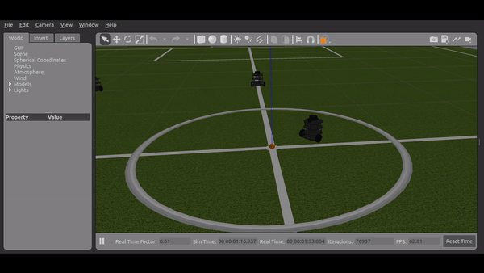
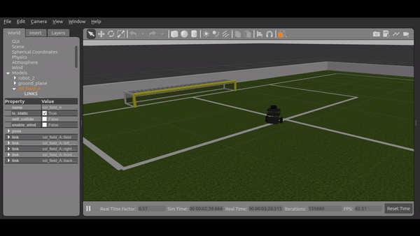
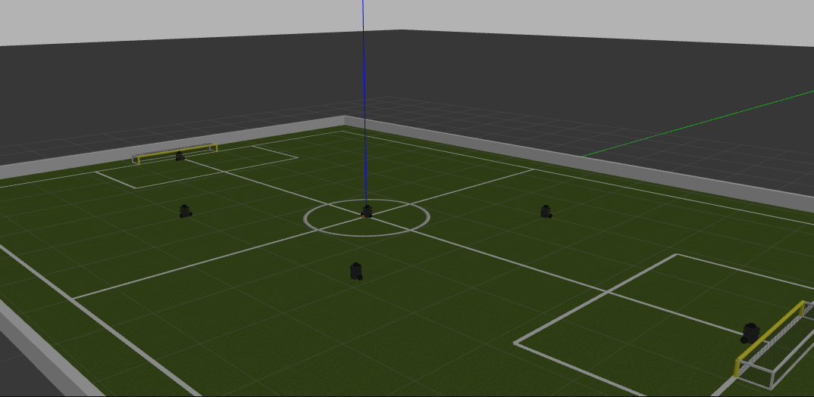

# SSL Simulator Using Gazebo-ROS
## Update Log

<p>&nbsp;</p>

### 10120004 - Nanda Pramudia Santosa
### 13520078 - Grace Claudia
### 13520109 - Patrick Amadeus Irawan
### 13520110 - Farrel Ahmad

<p>&nbsp;</p>

## Launching World

**12 July 2021 Update-1 "master" Branch**

Terminal Run List:
1. `$ roslaunch sslbot_gazebo sslbot.launch`
2. `$ rosrun sslbot_gazebo moveto.py`

To launch world and spawn SSL Field and Robots, run this command :
1. Clone the repository
```
$ git clone https://gitlab.com/dagozilla/academy/2021-internship2/group-1/ssl-simulator.git
```

2. cd to `/ssl-simulator`, change branch to `testing`, then cd to `/ssl_ws`
```
$ cd ssl-simulator
$ git checkout testing
$ cd ssl_ws
```

3. run `catkin_make`
```
$ catkin_make
```

4. Source `setup.bash`
```
$ source devel/setup.bash
```

5. Launch the world
```
$ roslaunch sslbot_gazebo sslbot.launch
```

6. The result will look like this


7. **(4 July 2021 Update-3)** : Now the SSL ball is spawned at the center of the field 


8. **(5 July 2021 Update)** : Now by using the newly created node called `ball_state_pub` which subscribes to a topic `/gazebo/model_states`, the ball's state (position and twist) is published to a topic `ball_state` 


rostopic list

<p>&nbsp;</p>


ball_state topic in rostopic echo  

9. **(10 July 2021 Update-1)** : Now the playing field has a barrier so the robot and the ball can't go outside of the playing field. Delete the visual tag of barrier link in ssl_field model to get invisible barrier instead of a colored one.  


10. **(10 July 2021 Update-2)** : changed the ball's color to orange to meet the standard of SSL Ball


11. **(14 July 2021 Update-1)** : localized the turtlebot3 urdf file that we used to make it better when development in changing hands and using different computer. We also localized the meshes that the urdf used.


12. **(14 July 2021 Update-2)** : updated the launch file to look for the model and asset in its own package

<p>&nbsp;</p>

## Robot Basic Movement

1. **(9 July 2021 Update-1, EXPERIMENTAL)** : turtlebot_1 will move to the ball's location . Just run this command after the program starts
```
rosrun sslbot_gazebo turtlebot_1_pub
```


First, turtlebot_1 will rotate to the ball's direction


Second, turtlebot_1 will move forward to the ball

<p>&nbsp;</p>

2. **(9 July 2021 Update-2)** : now using turtlebot3 urdf model to control it using ros control. First, get the turtlebot3 package (we're going to put the urdf in our workspace later on) by using this command
```
$ sudo apt-get install ros-noetic-dynamixel-sdk
$ sudo apt-get install ros-noetic-turtlebot3-msgs
$ sudo apt-get install ros-noetic-turtlebot3
```

roslaunch the usual launch file
```
$ roslaunch sslbot_gazebo sslbot.launch
```

run this program in another terminal (don't forget to source your setup.bash)
```
$ rosrun sslbot_gazebo moveto.py
```


at first, the turtlebot will correct its orientation to face the destination

<p>&nbsp;</p>


then, the turtlebot will head to its destination. Note that the program need to have angle tolerance in order for the program to work smoothly (the robot have inertia and acceleration).  

further improvement in tuning/calibration of the robot itself and let the moveto node to subscribe to a topic for its destination argument

this method is good for future update and improvement because the robot itself act as a node and receiving message from command topic like '/cmd_vel' and '/odom' which is useful for navigation (commonly used).  


<p>&nbsp;</p>

3. **(9 July 2021 Update-3)** : Now the turtlebot3 number 1 will follow the ball wherever it is. Even if we change the ball's position manually


<p>&nbsp;</p>

## Catch and Dribble
**12 July 2021 Update-1**

The dribble and shoot use `/gazebo/set_model_state` service that is called using `moveto` node. 

At first, the robot will follow the ball. Then, once the distance between the ball and the robot is < 0.15m, the ball will stay in front of the robot and will continue dribble. The ball stays in front of the robot (0.11 m apart) using `/gazebo/set_model_state` service by calling it a lot of times until certain circumstances. 

At the enemy goal, the robot will correct its' orientation, then the ball will be shot using `gazebo/set_model_state` by setting linear velocity to the ball. However the service is only called once.

**Watch this turtlebot3 catching and dribbling the ball**



<p>&nbsp;</p>


## Shoot and Goal or Out Detection 
**12 July 2021 Update-1**

Now the turtlebot can dribble the ball, go to (-2,-2), go to the enemy penalty area, and then kick the ball. Once the ball has been inside the goal. The simulator automatically pause and reset the world. Just play start on bottom left of the screen to start another simulation.

The bug that made turtlebot3 kick the ball twice to the goal in previous `moveto.py` commit has been fixed. The problem was on the goal out detection system in `moveto` node. Now the system has been moved to another specific node called `goalout_node` (cpp). However, in the current update, the goalout detection system only covers the enemy side of goal and out. Another area will be covered later.

The `goalout_node` automatically runs at launch. If the node crashes, it will automatically re-run.

**Watch this goal !**



<p>&nbsp;</p>

## Dribbling, Passing, and Shooting

**14 July 2021 Update-1**

Now the robots can dribble, pass, and shoot. Check out the new update in `master` branch. Setup is just the same as before. `catkin_make`, then source `setup.bash` and then run this command:
```
$ roslaunch sslbot_gazebo sslbot.launch
```

Nodes will run automatically at launch. Each robot is controlled by a node called (`robot_x.py`) with x is the number of the robot. For example, the robot that will pass the ball is robot no.1, thus it will be controlled by a node called `robot_1.py`.The other robot which will receive the ball is robot no.3, thus it will be controlled by a node called `robot_3.py`. Each robot has its' own node. 

The algorithm for dribbling was developed by Farrel. It's basically calling service set_model_state to the ball and set it in front of the robot many times. The robot will dribble when the it reaches a distance of < 0.15 m to the ball.

The algorithm for shooting was developed by Farrel and optimized by Nanda. Originally, the shooting algorithm used world reference to set the initial velocity of the ball. Later, Nanda optimized the algorithm by changing the reference to the robot's orientation. Thus, setting the x-axis velocity of the ball to positive numbers will always move forward and follow the robot's orientation. The original shooting algorithm can be seen in earlier commits in `master` and `testing` branch.

The algorithm for passing was developed by Nanda and optimized by Farrel. The algorithm here in `master` branch for passing was adopted, modified, and optimized by Farrel using Nanda's algorithm. Originally, the ball's Quaternion state update used an array of x, y, z, w of the robot with index from 0 to 3. However, the array was dynamic and this was prone to error as it sometimes the list is empty and caused several out of index error. Later, Farrel changed the dynamic array into the global variable of the robot's quaternion state for the ball's quaternion state update. This method is more fail-safe. 

The other optimization by Farrel was adding a little bit of conditional in passing algorithm when the ball is received by robot_3. The added conditional is used to prevent the ball keep appearing in both robot_1 and robot_3. This happened because both robot are calling the service to set the ball in from of them. Hence, the ball was "trying" to appear in both robots. With this added conditional, the robot_1 will not call the service after passing and only robot_3 after receiving the ball will call the service.

Nanda's original passing algorithm can be seen in branch `testing2` where he developed and tested the algorithm.

Other minor optimizations like passing angle and angular velocity was also done by Farrel. The passing angle between the robot which passes the ball and the robot which receives the ball was reduced from < 0.05 radian to < 0.01 radian for greater accuracy. The angular velocity when correcting the orientation to the goal was increased from 0.2 rad/s to 0.4 rad/s for faster movement.

Farrel also added `rosnode kill` command in `goalout_node.cpp` to shutdown all the robot nodes when the it restarts after goal or out. However, since the node is set to automatically run at launch and re-run when it crashes/shut down (`respawn = true`). The node will re-run in initial state condition. This is used to reboot the node back to the initial condition after goal or out to prevent errors.

Note : branch `master` is intended to be the main and most stable program, while `testing` is the branch where Farrel develops the program and algorithm, and `testing2` is the branch where Nanda develops the program and algorithm.

[**Click here to watch the video demonstration**](https://drive.google.com/file/d/1JsxeqhkQt6dOF6NjJHpbZxLlb17ZDDof/view?usp=sharing)

<p>&nbsp;</p>

## GoalKeeping

**15 July 2021 Update-1**

Now the keeper (robot_2) has its own URDF file, modified so its movement mechanism is no longer using differential drive, but planar move. To do this we created URDF and xacro file exclusive for robot_2. Nanda do this because differential drive plugin cannot work in tandem with planar move plugin. The newly added urdf and xacro file is _turtlebot3_burger_planar.gazebo.xacro_ and _turtlebot3_burger_planar.urdf.xacro_. after that, the robot can accept linear.y velocity and move sideways. The robot subscribe to topic /planar_vel for its velocity.

**15 July 2021 Update-2**

Now the turtlebot (robot_2) can do some goalkeeping action. When the ball is on the left side of the robot, it will strafe to the left, and whent the ball is on the right side of the robot, it will strafe to the right. Right now after the ball is close enough to the robot (0.15 m), it will catch the ball and then pass the ball to the other robot. The algorithm was developed by Nanda in `testing2` and then optimized by Farrel in `testing3`. You can view the original algorithm there.

<p>&nbsp;</p>

## Play Time !

**16 July 2021 Update-1 New Branch "testing4"**

Now the program fully simulates the robots playing soccer. The changing kickoff for each team has not been programmed. For testing reason, move one of the two robots farther that are chasing the ball once the program starts. This is to ensure only one of them gets the ball. After that, it will simulate and the simulation can be watched carefully. This is not the final version because it's not optimized yet. Also the Real Time Factor on Farrel's laptop is about 0.25 to 0.30, so expect the slow simulation.

to start the program. Same as the previous update. Clone the repository, cd to `/ssl-simulator/ssl_ws`, then `catkin_make`, source `setup.bash`, and then run this command (all nodes are run automatically)

```
$ roslaunch sslbot_gazebo sslbot.launch
```



<p>&nbsp;</p>

## Final Program Prototype 2 (Fully Usable, without Real SSL Model)
**17 July 2021 Update-1**

Now the program can execute kickoff with different teams. The algorithm is adopted and modified using Nanda's alogrithm from branch `testing5`. The kickoff team will change everytime there is a goal.

<p>&nbsp;</p>

## Final Program (Fully Usable, with Real SSL Model)
**18 July 2021 Update-1**

Now the simulation already using the model that the that was given from the mechanical division of our Group. Farrel also tune the program to suit the new model more, now the distance between the ball and the robot when dribbling is increased from 0,09m to 0,11m. Now the simulation should look like this,

